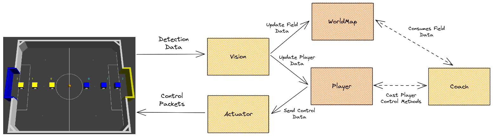

# Armorial-PSEL

This repository contains the base implementation for the Maracatronics Robotics Programming Selective Proccess. The core objective of this project is to provide a simple interface (simmilar to the used in our main project) that allows to receive data from the simulated environments and send control packets to the robots inside it.

## Project Requirements

Currently, the known supported OS is Ubuntu in both 20.04 and 22.04 versions (check the github actions to see the build workflow for both of them). You will need to install the dependencies by just following the above command:

```bash
sudo apt-get update && sudo apt-get install build-essential cmake qtbase5-dev qt5-qmake libprotobuf-dev protobuf-compiler libprotoc-dev protobuf-compiler-grpc libgrpc++-dev libgrpc-dev libqt5serialport5-dev google-mock libgmock-dev libgtest-dev libspdlog-dev libfmt-dev && sudo apt-get upgrade
```

## Project Structure

As mentioned above, this project contains a structure that is heavily based in our main project. When navigating to the **src** folder, you will found the **entities** and **utils** folders.

### Entity

An Entity is a module of our code. They generally provides interfaces to allow communication for between both outside (with the simulated environment for example) or inside (with the **Player** and **Actuator** integration, where the players can send control information through it).

Currently, we have the implementation of 5 entities in our project:

- **Actuator**: Provides an interface for the communication with the simulated environment to control the robots.
- **Vision**: Provides an interface for the reception of detection packets from the simulated environment.
- **Player**: Provides an interface for a robot in the simulated environment, allowing to get information and control it.
- **WorldMap**: Provides an interface to get information about some field RoI (region of interests) and also ball data.
- **Coach**: Provides an interface to manage and control all the robots in the simulated environment.

### Utils

The Utils folder contains methods and classes that are commonly used in our project modules. Commonly, you will find here the **types** folders along with a **Utils** class itself. The **types** folder contains interfaces to enhance the data transfer along the integrations between the Entities and the **Utils** class contains **static** useful generic methods that can be used everywhere in the code, generally related to math calculus.

## Workflow Diagram



## Controlling the Robots

In the [coach](src/entities/coach/coach.cpp) main code, you can find a method called **runCoach**. Here, you can find a base implementation which shows how to control the robots in the field, but let's take a deep look inside:

```cpp
void Coach::runCoach() {
    // Here you can control the robots freely.
    // Remember that the getPlayer(color, id) function can return a std::nullopt object, so
    // be careful when you use it (remember to only use ids from 0-2 and the BLUE and YELLOW
    // defines).

    // Example 1: here we get the ball position and set the BLUE and YELLOW player 0 to follow it
    QVector2D ballPosition = getWorldMap()->ballPosition();
    getPlayer(BLUE, 0).value()->goTo(ballPosition);
    getPlayer(YELLOW, 0).value()->goTo(ballPosition);

    // Example 2: here we set the BLUE and YELLOW players 1 and 2 to rotate to the ball
    getPlayer(BLUE, 1).value()->rotateTo(ballPosition);
    getPlayer(BLUE, 2).value()->rotateTo(ballPosition);
    getPlayer(YELLOW, 1).value()->rotateTo(ballPosition);
    getPlayer(YELLOW, 2).value()->rotateTo(ballPosition);
}
```

To control any robot in the field, first you need to call the **getPlayer(isTeamBlue, playerId)** method. It provides a [std::optional](https://en.cppreference.com/w/cpp/utility/optional) return, which means that sometimes you will not receive the pointer for the Player that you want if the player is **not registered in the code**, so be careful with that. Just for note, you can use the **BLUE** and **YELLOW** defines to refers to the blue and yellow teams, respectively, and can use the players id from 0-2 for both teams.

After cast the **getPlayer** method successfully, you will get it's **value** that will refers to a **Player** pointer. With that on hand, you will be able to cast the [Player](src/entities/player/player.h) class public and protected methods (note that the Coach class is registered as friend class on Player). So, you can call the **goTo** and **rotateTo** methods along with getters for the player position / orientation and identifiers.

In this coach method you can also get the **WorldMap** class by using the **getWorldMap()** method. With that on hand you will be able to use all the available methods in [WorldMap](src/entities/worldmap/worldmap.h) class, such as position of some region of interests and the ball position.